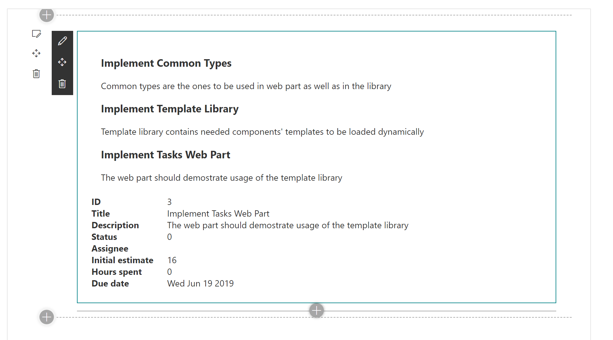

## React Templates using SPFx Library Component
This project showcases how a developer can use dynamic React components (templates) in SPFx web parts, and how to package and dynamically load these templates using SPFx Library Components and `SPComponentLoader`.

### Why that may be useful
Templating is a pretty powerful approach to provide extensibility to a project/component/library. It can be used to deliver different behaviors and/or look and feel to different customers, or provide extendable open-source libraries.

There are a lot of template libraries out there tha can be used in your project. 
One of the most popular is [Handlebar.js](https://handlebarsjs.com/).
The problem with these libraries is that in most cases they provide you an ability to define "static" content (basically, HTML and CSS). And if you want to include some actionable content (e.g. handle events from outside the template, etc.) - it might be either tricky or impossible.

The idea of this project was to showcase how we can dynamically render React components as well as dynamically load these components from modules that are not included into our project.

And, because, we're working with SPFx, SPFx Library Component is a great way for creating templates libraries.

### What the sample does
The sample contains a web part that renders a list of tasks and task details of the selected task.
Default UI of the web part looks like that:

UI based on templates:

### Structure of the Project
There are 4 folders in the project:

#### common
`common` folder contains single file `CommonTypes.ts`. It contains definitions of all the interfaces and types (let's call it a contract) that must be implemented by the templates library. In my case I was just copying this file to other projects to have all the types where I need them.

#### tasks-webpart
`tasks-webpart` is a SPFx web part to render list of tasks and details of a selected task. It has its own React components to render task list, task, and task details. And it also allows to load external SPFx Library Component and use React components from there. It is implemented with `componentId` property of the web part, which is a Component Id from SPFx Library Component manifest, and `TemplateFactoryLoader` class that loads needed Library Component using `SPComponentLoader`.

#### templates-library
`templates-library` is an SPFx Library Component that implements the contract and provides alternative templates to render task list, task, and task details.

#### assets
`assets` folder is used to store images for README file. It is not actual part of the solution.

### Implementation Details
The main idea here is each Library Component must have an implementation of `ITemplateFactory` interface. And the class that implements the interface must be a default `export` called `TemplatesLibrary`.
`TemplateFactoryLoader` loads a module (Library Component) based on provided `componentId` and instantiates the template factory.
Later on, the template factory is used to get React components to render.

### How to Deploy and Use
There are 2 separate SPFx project that should be packaged and deployed separately.
So, before debugging or deploying, you need to run `npm i` on both the projects.

#### templates-library
To package and deploy the Library Component you need to proceed with steps 1 and 2 from **How to deploy and consume a 3rd party SPFx library from tenant app catalog** section of [Library component tutorial](https://docs.microsoft.com/en-us/sharepoint/dev/spfx/library-component-tutorial#how-to-deploy-and-consume-a-3rd-party-spfx-library-from-tenant-app-catalog).

#### tasks-webpart
`tasks-webpart` is a regular SPFx web part that can be debugged and/or packaged and deployed as described in the official documentation: [debug](https://docs.microsoft.com/en-us/sharepoint/dev/spfx/web-parts/get-started/build-a-hello-world-web-part), [build and deploy](https://docs.microsoft.com/en-us/sharepoint/dev/spfx/web-parts/basics/notes-on-solution-packaging)